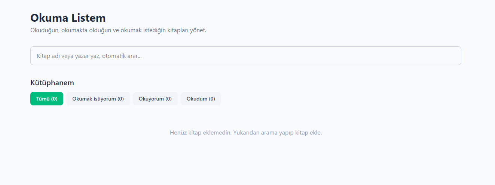
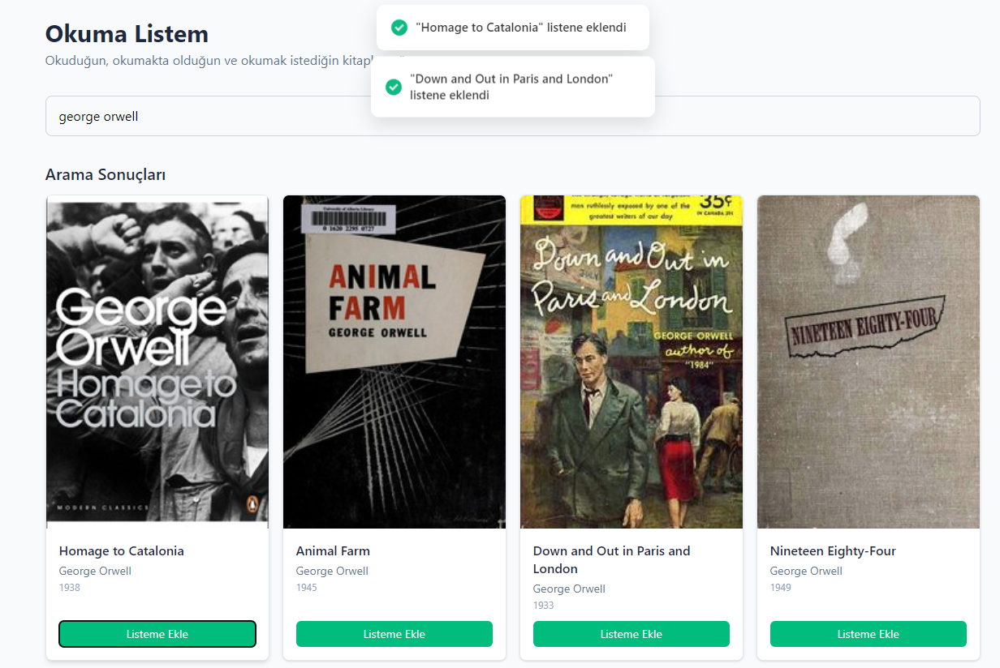
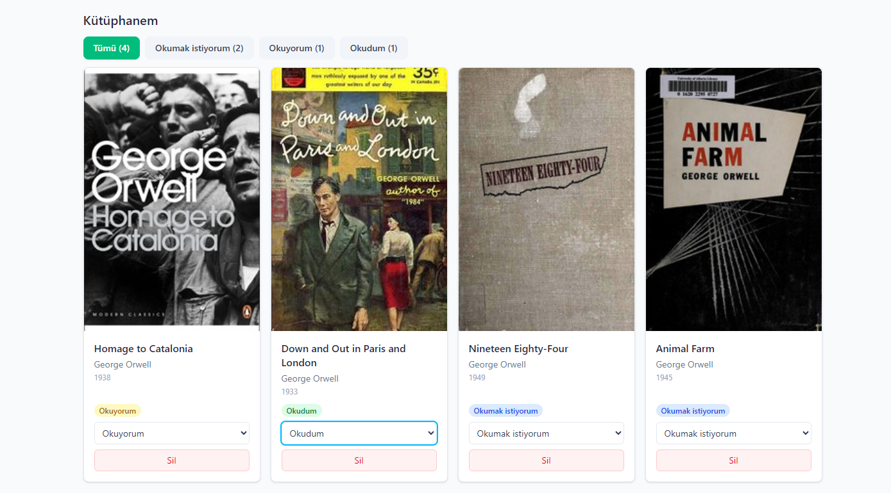

# 📚 Okuma Listem (Reading List)

Open Library API üzerinden kitap arayıp kişisel okuma listesi oluşturmanı sağlayan bir React uygulaması. Tüm veriler tarayıcının localStorage'ında saklanır — backend'siz, hesap gerektirmeden çalışır.

> **TNC Group 14. Dönem Software Persona Stajı** — Web Geliştirme; JavaScript modülü proje teslimi.

---

## 🌐 Canlı Demo

**Vercel:** [https://reading-list-abdulsamed.vercel.app](https://reading-list-abdulsamed.vercel.app)

> Link deploy sonrası güncellenecektir.

---

## 📸 Ekran Görüntüleri

### Anasayfa
Uygulama açıldığında popüler kitaplar otomatik listelenir.



### Dinamik Arama
Yazdıkça arama otomatik tetiklenir (debounce ile, 350ms gecikmeli).



### Okuma Listesi
Eklediğin kitapları durumlarına göre filtreleyebilirsin.



---

## ✨ Özellikler

- 🔍 **Dinamik arama** — Open Library API ile gerçek zamanlı arama (debounce'lu)
- ➕ **Ekle / 📝 Listele / 🔄 Güncelle / 🗑️ Sil** — Tam CRUD desteği
- 🏷️ **Üç durum** — Okumak istiyorum, Okuyorum, Okudum
- 🎯 **Durum filtreleme** — Listeyi durumlara göre filtrele
- 💾 **Otomatik kaydetme** — Tüm değişiklikler localStorage'a yazılır
- 🔔 **Toast bildirimleri** — Her aksiyonda görsel geri bildirim
- 🎨 **Responsive tasarım** — Mobil, tablet ve masaüstünde sorunsuz çalışır
- ⚡ **Yumuşak animasyonlar** — Kart geçişlerinde fade-in efekti

---

## 🛠️ Kullanılan Teknolojiler

| Teknoloji | Amaç |
|-----------|------|
| **React 18** | UI kütüphanesi |
| **Vite** | Build aracı ve dev server |
| **Tailwind CSS v4** | Styling |
| **axios** | HTTP istekleri |
| **react-hot-toast** | Bildirim sistemi |
| **Open Library API** | Kitap verisi kaynağı |

---

## 📁 Proje Yapısı

```
reading-list/
├── public/
├── screenshots/              # README için ekran görüntüleri
├── src/
│   ├── Components/           # Yeniden kullanılabilir UI parçaları
│   │   ├── BookCard.jsx
│   │   ├── BookList.jsx
│   │   ├── SearchBar.jsx
│   │   └── StatusFilter.jsx
│   ├── Pages/                # Sayfa bileşenleri
│   │   └── HomePage.jsx
│   ├── Interfaces/           # JSDoc tip tanımları
│   │   └── bookTypes.js
│   ├── hooks/                # Özel React hook'ları
│   │   └── useLocalStorage.js
│   ├── services/             # API servisleri
│   │   └── bookApi.js
│   ├── App.jsx
│   ├── main.jsx
│   └── index.css
├── index.html
├── package.json
├── vite.config.js
└── README.md
```

---

## 🚀 Kurulum ve Çalıştırma

### Ön Gereksinimler

- Node.js 18 veya üzeri
- npm

### Adımlar

1. **Repoyu klonla:**
   ```bash
   git clone https://github.com/<kullanici-adin>/reading-list.git
   cd reading-list
   ```

2. **Bağımlılıkları yükle:**
   ```bash
   npm install
   ```

3. **Geliştirme sunucusunu başlat:**
   ```bash
   npm run dev
   ```

4. **Production build:**
   ```bash
   npm run build
   ```
   Build çıktısı `dist/` klasöründe oluşturulur.

Uygulama `http://localhost:5173` adresinde çalışır.

---

## 🧠 Kullanılan React Kavramları

Eğitimde işlenen temel React konseptleri projede aktif olarak kullanıldı:

- `useState` — Form input'ları, liste state'i, filtre durumu
- `useEffect` — API çağrıları, debounce, localStorage senkronizasyonu
- `useMemo` — Filtrelenmiş listenin ve sayıların hesaplanması (performans)
- **Custom Hook** — `useLocalStorage` ile state'in localStorage ile senkron yönetimi
- **Props** — Parent → child veri akışı
- **Conditional rendering** — `&&` ve `? :` operatörleri ile şartlı render
- **Array methods** — `map`, `filter`, `find`, `some` ile veri dönüşümü
- **Component composition** — Küçük, tek sorumluluklu bileşenler

---

## 🔌 API

Uygulama Open Library Search API kullanır:

```
https://openlibrary.org/search.json?q={query}&limit={limit}
```

API anahtarı gerektirmez. Açık ve ücretsizdir.

---

## 💾 Veri Saklama

Tüm kullanıcı verileri tarayıcının localStorage'ında, `reading-list:books` anahtarı altında JSON olarak saklanır. Sunucu veya hesap yoktur.

---

## 📋 Yönerge Kontrol Listesi

- [x] Modern JavaScript kütüphanesi seçildi (React)
- [x] Vite ile kurulum yapıldı
- [x] Components/, Pages/, Interfaces/ klasör yapısı
- [x] Tailwind CSS kullanıldı
- [x] Ekle işlemi
- [x] Listeleme işlemi
- [x] Güncelleme işlemi
- [x] Silme işlemi
- [x] Ekran görüntüleri eklendi (3 adet)
- [ ] GitHub'a public yüklendi
- [ ] Vercel ile yayına alındı

---

## 👤 Yazar

**Abdulsamed**
TNC Group 14. Dönem Stajyeri

---

## 📄 Lisans

Bu proje eğitim amaçlı geliştirilmiştir.
